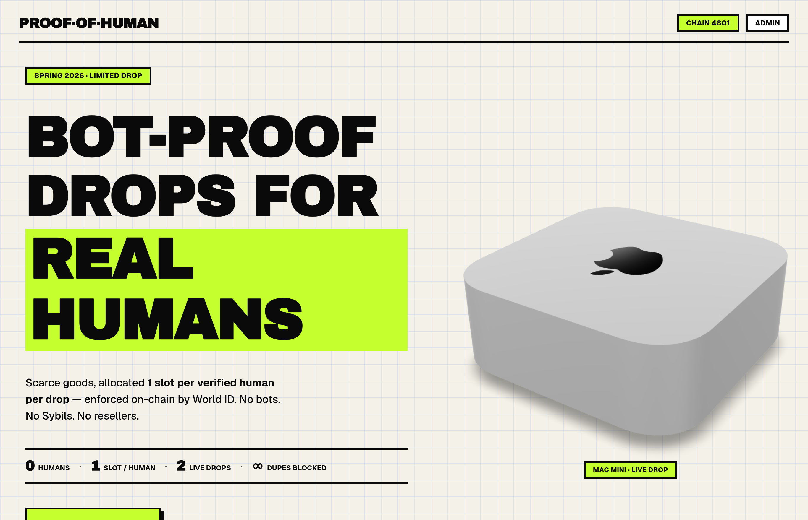
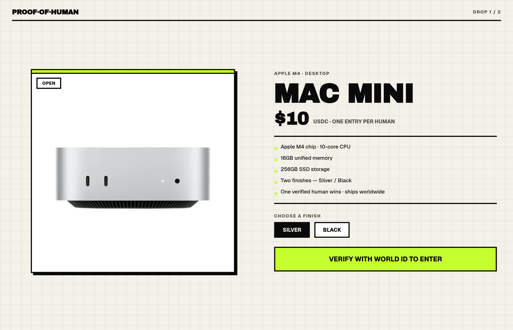
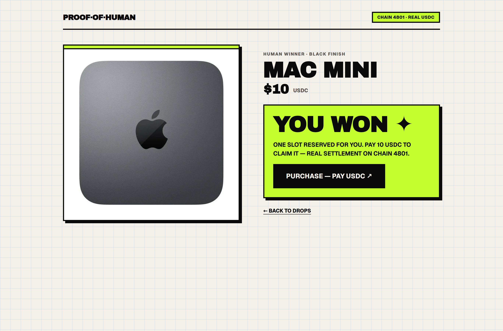
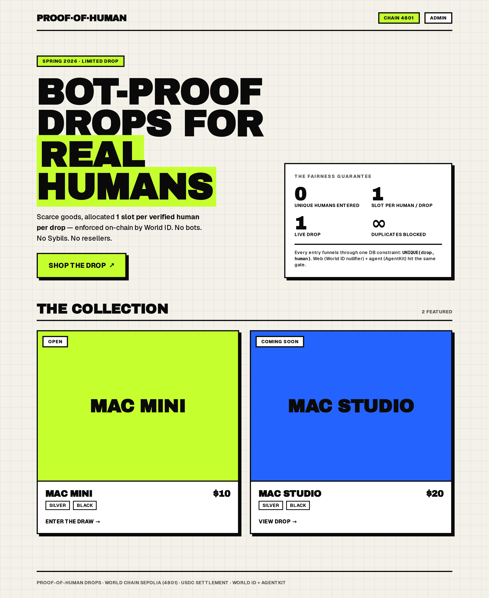
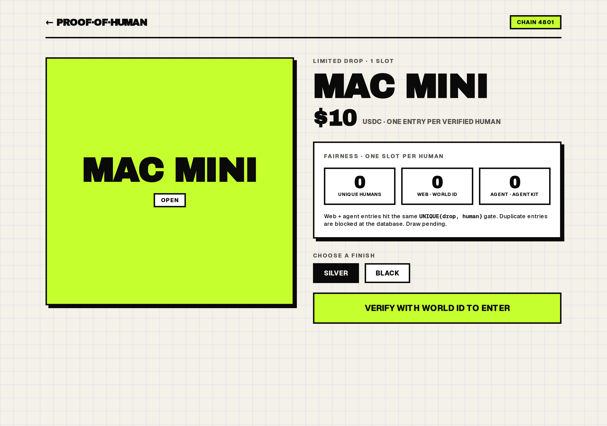

# Proof-of-Human Drops

**1st Place — World AgentKit Track, ETHGlobal NYC 2026**

A bot-proof scarce-goods drop platform. When a Mac Mini sells out in seconds because bots sweep every drop, the problem is not inventory — it is verification. Proof-of-Human Drops enforces **one raffle entry per verified human per drop**, whether that human enters themselves or delegates to their AI agent.

**[Live Demo](https://worldcoinapp-production.up.railway.app)**



---

## The Problem

Scarce-goods drops (limited sneakers, GPUs, hardware) are immediately swept by bots. Existing anti-bot measures (CAPTCHAs, purchase limits) are easily bypassed. Meanwhile, AI agents acting on behalf of real users are indistinguishable from pure bots under these systems — legitimate delegation gets caught in the same net as abuse.

## The Solution

Two entry surfaces, one backend, all gated by proof-of-humanity:

- **Web app** — humans verify in-browser with [World ID v4](https://docs.world.org/world-id) (biometric, zero-knowledge proof). One verified entry per drop.
- **MCP server** — a user's AI agent (Claude, ChatGPT, etc.) connects via [Model Context Protocol](https://modelcontextprotocol.io) and carries an [AgentKit](https://docs.world.org/world-id/solutions/agent-kit) credential proving it acts on behalf of a specific verified human.

Entries are anonymous on-chain. When the countdown hits zero, the server selects a winner via CSPRNG and settles a real USDC transfer on World Chain Sepolia — no manual trigger, no admin intervention.



---

## How It Works

```
User (browser)                    User's AI Agent (MCP client)
      |                                      |
      |  World ID v4 ZK proof                |  AgentKit credential
      v                                      v
   /api/drops/:id/enter          /api/mcp  (5 tools: list_drops,
      |                           get_drop_info, enter_draw,
      |                           check_status, purchase)
      +--------------+------------------------+
                     v
              PostgreSQL (Drizzle ORM)
              entries, drops, sessions
                     |
                     v
           Server-side countdown (no polling)
           CSPRNG winner draw at T=0
                     |
                     v
           USDC transfer, World Chain Sepolia (chain 4801)
           viem, winner settlement
```



---

## Tech Stack

| Layer | Tech |
|---|---|
| Framework | Next.js 16 (App Router), React 19, TypeScript |
| Identity | World ID v4 (`@worldcoin/idkit`), World AgentKit |
| Agent surface | Model Context Protocol SDK (`@modelcontextprotocol/sdk`) |
| Database | PostgreSQL via Drizzle ORM |
| Web3 | viem, World Chain Sepolia (chain 4801), USDC |
| UI | shadcn/ui, Tailwind CSS v4 |
| Deployment | Railway (app + DB) |

---

## Running Locally

```bash
git clone https://github.com/JackREscowitz/Proof-Of-Human-Drops
cd Proof-Of-Human-Drops
cp .env.example .env   # fill in World ID credentials + DB URL
npm install
npm run dev
```

Or with Docker:

```bash
docker compose up -d --build
```

See [DEMO_RUNBOOK.md](./DEMO_RUNBOOK.md) for the full demo setup including wallet funding and drop seeding.

---

## Screenshots

| Landing | Drop | Winner |
|---|---|---|
|  |  |  |

---

## Built at ETHGlobal NYC 2026

Built in 3 days for the World AgentKit track. The track asked teams to build applications using World's AgentKit to verify that AI agents act on behalf of real humans. The insight: the same trust primitive that stops bots from impersonating humans can also let legitimate AI agents prove they represent a real person, turning anti-bot infrastructure into pro-agent infrastructure.
